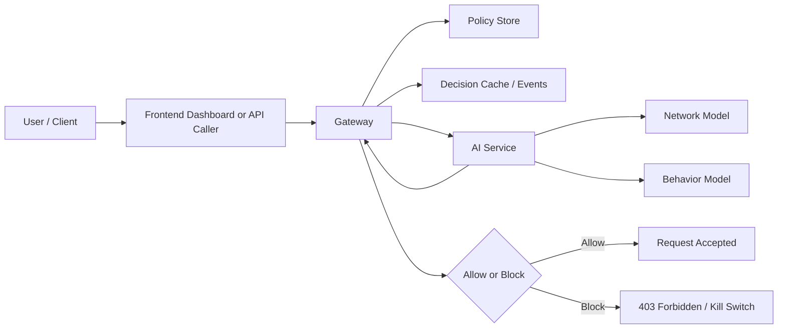
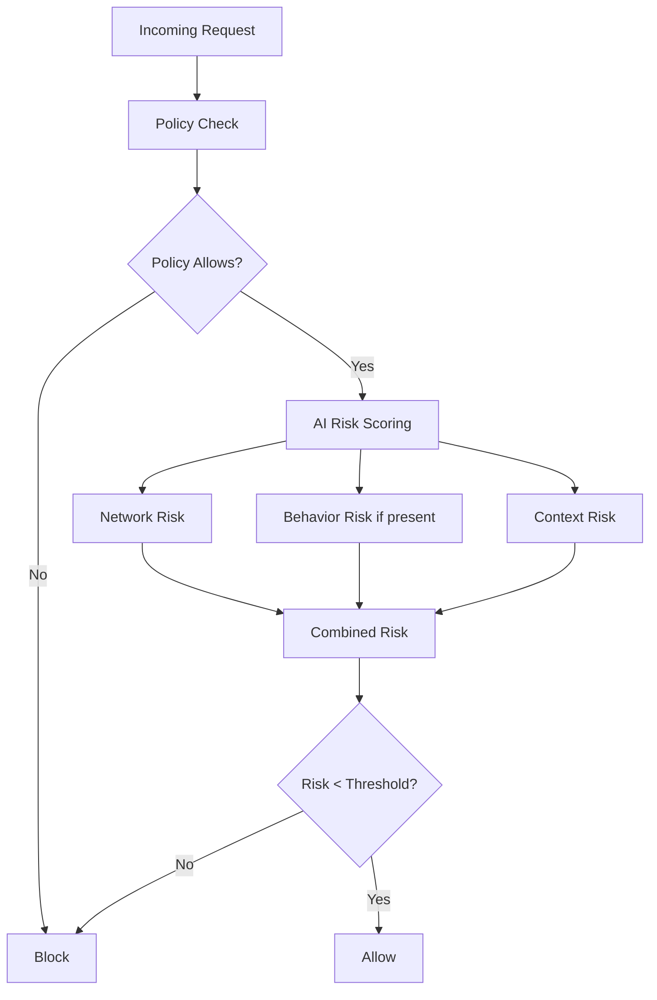

# PREREQUISITES

## 1. What This Project Is About

This project is a Zero-Trust Access (ZTA) proof of concept.

Its purpose is to answer a more serious question than normal login systems usually ask:

> "Even if this request is authenticated, should it still be trusted right now?"

Instead of trusting a user only because:
- they logged in successfully, or
- they have a valid token,

the system checks:
- whether policy allows the action,
- whether the traffic pattern looks suspicious,
- whether the optional user behavior signals match the expected person.

So this is not just an authentication project.  
It is an **access-decision project**.

## 2. What We Are Trying To Achieve

The immediate goal is to build a working security gateway that can:

1. receive a request,
2. verify whether the request is allowed by policy,
3. score its risk using AI/ML,
4. return `allow` or `block`,
5. log the decision for operator visibility.

In practical terms, the project aims to detect and respond to cases like:
- valid user doing invalid route access,
- stolen credentials being used abnormally,
- sudden request floods,
- unusual typing/interaction behavior,
- suspicious off-hours admin usage.

## 3. Big-Picture Intuition

Think of the system as a secure building:

- **Frontend** = the security control room dashboard
- **Gateway** = the guard at the checkpoint
- **Policy DB** = the access-rule manual
- **AI service** = the threat analyst helping the guard
- **Event store** = the incident diary
- **Azure blocker** = the mechanism to lock the outer gate

If a person shows an ID card:
- the guard checks the rulebook,
- then asks the analyst: "Does this person seem normal?"
- then either opens the door or locks it.

## 4. System Flow Diagram

## 5. What Makes This Different From Normal Apps

In a normal CRUD application:
- frontend sends request,
- backend checks auth,
- backend performs DB operation.

In this system:
- the request itself becomes the subject of evaluation,
- access is dynamic,
- risk can override simple "user exists" logic.

This means the project sits at the intersection of:
- distributed systems,
- backend engineering,
- applied cybersecurity,
- anomaly detection,
- operational visibility.

## 6. Core Computer Science Fundamentals Needed

You do not need a PhD to understand the codebase, but you do need comfort with the following ideas.

### 6.1 Client-Server Model

You should understand:
- what a client is,
- what a server is,
- how HTTP requests and responses work.

Relevant here:
- browser/frontend sends request,
- gateway handles decision,
- gateway calls AI service over HTTP.

### 6.2 APIs And JSON Contracts

This project is API-driven.

You should understand:
- REST-style endpoints,
- `GET` vs `POST`,
- JSON request/response bodies,
- status codes like `200`, `400`, `403`.

Examples in this repo:
- `/api/evaluate`
- `/api/events`
- `/api/kill-switch`
- `/score`

### 6.3 Backend Routing And Request Processing

The gateway decides what to do with a request by:
- matching the route,
- extracting input,
- checking DB state,
- calling another service,
- returning a decision.

This requires understanding:
- request lifecycle,
- middleware/handler flow,
- serialization/deserialization,
- dependency injection at a basic level.

### 6.4 Databases

There are two important DB concepts here:

1. **Policy store**
- stores who can access what.

2. **Decision/event store**
- stores recent decisions, blocked IPs, event stream.

You should understand:
- tables/entities,
- primary keys,
- querying,
- indexes at a basic level,
- why caching reduces repeated work.

This project currently uses:
- SQLite locally,
- optional SQL Server/Azure SQL path.

### 6.5 Caching

The gateway keeps short-lived decisions in cache storage.

Why:
- avoid rescoring identical requests too often,
- reduce latency,
- reduce pressure on the AI service.

You should understand:
- cache hit,
- cache miss,
- time-to-live (TTL),
- consistency tradeoff.

### 6.6 Basic Networking

This project is heavily network-oriented.

You should understand:
- IP address,
- ports,
- service URLs like `localhost:5000`,
- local inter-service communication.

Examples:
- frontend on `5173`
- gateway on `5000`
- AI service on `8000`

### 6.7 Authentication vs Authorization

This distinction is critical.

- **Authentication** = "Who are you?"
- **Authorization** = "What are you allowed to do?"

This project mainly focuses on **authorization + risk evaluation after identity is known**.

### 6.8 Zero Trust Security

Zero Trust means:

> never trust implicitly, always verify explicitly.

In practice:
- no request is assumed safe just because it came from an internal source,
- policy and behavior are checked continuously,
- risk signals influence access.

### 6.9 Anomaly Detection Basics

The AI service includes a network anomaly model.

Conceptually:
- the model learns what "normal" looks like,
- unusual patterns get higher anomaly scores.

You should understand:
- features,
- model input vs output,
- anomaly score,
- threshold,
- false positives / false negatives.

### 6.10 Behavioral Biometrics

Behavioral scoring is based on user timing patterns.

Examples:
- key hold time,
- key transition latency,
- repeatable typing rhythm.

The core idea:
- same credentials can be stolen,
- but attacker behavior often differs from original user patterns.

### 6.11 Distributed Systems Basics

Even though this is a local PoC, it is already a distributed system.

Why:
- frontend, gateway, and AI service are separate processes,
- each has its own failure modes,
- one service may be up while another is down.

You should understand:
- service boundaries,
- timeouts,
- retries,
- partial failure,
- health checks.

### 6.12 Operational Thinking

Security systems are not only about code correctness.

They must answer:
- what happened?
- why was a request blocked?
- can an operator inspect events?
- can the system be restarted safely?

That is why this project has:
- event stream,
- kill-switch,
- health endpoints,
- documentation/runbook files.

## 7. Theory Diagram: Decision-Making Logic

## 8. Basic Math/ML Intuition You Should Know

You do not need deep ML theory to follow the current implementation, but these ideas matter:

### 8.1 Features

A model does not understand "a request" directly.  
It only sees numbers.

Examples:
- requests per minute,
- payload size,
- request latency,
- key timing values.

### 8.2 Threshold

A model often outputs a score, not a yes/no decision.

Then a threshold is applied:
- below threshold = normal enough,
- above threshold = suspicious enough.

### 8.3 Reconstruction Error

Behavior model intuition:
- train model on normal user behavior,
- ask it to reconstruct that behavior,
- if reconstruction is poor, input may be unusual.

### 8.4 Tradeoff

Security ML always has a tradeoff:
- lower threshold catches more attacks but blocks more good traffic,
- higher threshold reduces false alarms but may miss threats.

## 9. Technologies In This Repo

### Frontend
- React
- Vite

Used for:
- operator dashboard
- event stream visualization
- manual kill-switch interaction

### Gateway
- ASP.NET Core
- EF Core

Used for:
- policy evaluation
- event storage
- AI orchestration
- access decision output

### AI Service
- FastAPI
- joblib-loaded model artifacts
- NumPy / pandas / scikit-learn runtime stack

Used for:
- risk scoring
- model loading
- behavior and network decision support

### Storage
- SQLite local runtime DBs
- optional SQL Server / Azure SQL path

### Infrastructure Planning
- Docker Compose already exists as a starter path
- Azure templates exist
- Kubernetes is a future deployment concern, not a current local requirement

## 10. What You Should Be Able To Explain After Reading This

If you understand this file, you should be able to explain:

1. why authentication alone is not enough,
2. how policy and anomaly detection work together,
3. why multiple services exist instead of one giant backend,
4. why a security dashboard needs event visibility,
5. why behavior models are useful even when credentials are valid,
6. where the project currently ends and where production-hardening would begin.

## 11. Suggested Learning Order

If you are new to the project, use this order:

1. Read [README.md](e:/SAVED_CODES_AND_PROJECT/code-playing/ZTA/README.md)
2. Read [LOCAL_API_AND_RUNBOOK.md](e:/SAVED_CODES_AND_PROJECT/code-playing/ZTA/LOCAL_API_AND_RUNBOOK.md)
3. Read [ARCH.md](e:/SAVED_CODES_AND_PROJECT/code-playing/ZTA/ARCH.md)
4. Read [THEORY.md](e:/SAVED_CODES_AND_PROJECT/code-playing/ZTA/THEORY.md)
5. Then inspect:
- [Program.cs](e:/SAVED_CODES_AND_PROJECT/code-playing/ZTA/src/gateway/Zta.Gateway/Program.cs)
- [main.py](e:/SAVED_CODES_AND_PROJECT/code-playing/ZTA/src/ai-service/app/main.py)
- [App.jsx](e:/SAVED_CODES_AND_PROJECT/code-playing/ZTA/src/web/src/App.jsx)

## 12. Final Perspective

This project is best understood as a **decision system**, not just a web app.

It combines:
- software architecture,
- security policy,
- anomaly detection,
- behavior modeling,
- operator observability.

That combination is the real subject of the project.
