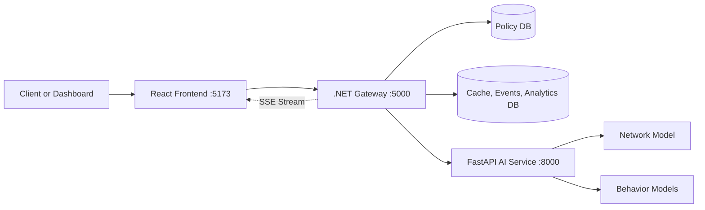

# ZTA: Zero-Trust Access Project

This repository contains a working zero-trust access system built with:

- React frontend (premium SOC dashboard with dark/light themes)
- .NET 10 gateway with Polly resilience
- Python AI scoring service with ML explainability
- SQLite and optional SQL Server storage

The project evaluates whether a request should be allowed even after identity is known.

## What The Project Does

For each request, the system checks:

1. policy: is this user allowed on this route and method?
2. network risk: does the request pattern look anomalous?
3. behavior risk: if behavior features are present, do they look like the expected user?
4. context: is the path, method, or timing suspicious?
5. explainability: which features drove the anomaly score? (NEW)

The request is allowed only when:

1. policy matches
2. combined risk stays below the threshold

## Architecture



## Tech Stack

### Frontend

- `React 19`
- `Vite 7`
- `JavaScript`
- Vanilla CSS with dark/light theme system
- Server-Sent Events (SSE) for real-time updates
- Canvas-based analytics charts

### Backend Gateway

- `C#`
- `.NET 10`
- ASP.NET Core Minimal APIs
- `Entity Framework Core`
- `Microsoft.Extensions.Http.Resilience` (Polly circuit breaker + retry)
- `System.IdentityModel.Tokens.Jwt`

### AI Service

- `Python`
- `FastAPI`
- `Pydantic`
- `NumPy`
- `Pandas`
- `scikit-learn`
- `joblib`
- `Uvicorn`
- ML Explainability (per-feature anomaly contributions)

### Databases

- `SQLite` (policy, cache, events, analytics snapshots)
- `SQL Server Developer Edition` (optional policy store)

## Repository Structure

```text
ZTA/
  src/
    web/                    # React premium dashboard
      src/
        components/         # ThemeToggle, RiskGauge, LiveFeed, AnalyticsPanel
        App.jsx             # Main dashboard layout
        api.js              # Gateway API client
        styles.css          # Dual-theme CSS system
    gateway/Zta.Gateway/    # .NET gateway with resilience
    ai-service/             # Python AI scoring service
  database/migrations/      # SQL scripts for DB setup
  tests/                    # smoke tests and gateway test scaffold
  README.md
  THEORY.md
```

## Local URLs

### Frontend

- App: `http://localhost:5173`

### Gateway

- Base: `http://localhost:5000`
- Health: `http://localhost:5000/health`
- Policies: `http://localhost:5000/api/policies`
- Events: `http://localhost:5000/api/events`
- Events SSE Stream: `http://localhost:5000/api/events/stream`
- Analytics: `http://localhost:5000/api/analytics?hours=24`
- Evaluate: `http://localhost:5000/api/evaluate`
- Kill switch: `http://localhost:5000/api/kill-switch`

### AI Service

- Base: `http://localhost:8000`
- Health: `http://localhost:8000/health`
- Config: `http://localhost:8000/config`
- Score: `http://localhost:8000/score`
- Feedback: `http://localhost:8000/feedback`
- Debug behavior score: `http://localhost:8000/debug/behavior-score`
- Reload models: `http://localhost:8000/reload-models`

## How To Run Locally

## Step 1: Install dependencies

From repo root:

```powershell
cd e:\SAVED_CODES_AND_PROJECT\code-playing\ZTA
.\install-all.ps1
```

This installs:

- Python packages into local `.venv`
- frontend packages into local `node_modules`
- .NET packages with local cache paths

## Step 2: Start the AI service

```powershell
cd e:\SAVED_CODES_AND_PROJECT\code-playing\ZTA\src\ai-service
& "e:\SAVED_CODES_AND_PROJECT\code-playing\ZTA\.venv\Scripts\python.exe" -m uvicorn app.main:app --host 0.0.0.0 --port 8000 --reload
```

Expected:

- terminal shows startup complete
- `http://localhost:8000/health` works
- model counts appear in response

## Step 3: Start the gateway

```powershell
cd e:\SAVED_CODES_AND_PROJECT\code-playing\ZTA\src\gateway\Zta.Gateway
dotnet run
```

Expected:

- gateway starts on `http://localhost:5000`
- database bootstrap runs (including new AnalyticsSnapshots table)
- demo policies are seeded if missing

## Step 4: Start the frontend

```powershell
cd e:\SAVED_CODES_AND_PROJECT\code-playing\ZTA\src\web
npm run dev
```

Expected:

- Vite starts
- open `http://localhost:5173`
- premium dark/light dashboard with live SSE connection

## Step 5: Verify the system

```powershell
curl http://localhost:8000/health
curl http://localhost:5000/health
curl http://localhost:5000/api/policies
curl http://localhost:5000/api/events
curl http://localhost:5000/api/analytics
```

## Key Features

### ML Explainability (XAI)

The AI service now returns per-feature anomaly contributions in the `/score` response, showing exactly which metrics (requests_per_minute, payload_bytes, etc.) drove the anomaly score.

### Gateway Resilience (Polly)

The C#-to-Python connection uses Polly with:
- 3 retry attempts with jitter
- Circuit breaker (opens after 5 failures, auto-heals after 15s)
- Per-attempt timeout (3s) and total timeout (10s)

### Real-Time Dashboard (SSE)

The frontend connects to `/api/events/stream` via Server-Sent Events for instant toaster notifications when anomalies are detected.

### Historical Analytics

An `AnalyticsService` background worker computes hourly rollups (avg risk, block rate, event counts) stored in SQLite. The dashboard renders these as Canvas-based stacked bar + line charts.

### Theme System

- **Light mode**: White + olive green (warm, professional)
- **Dark mode**: Black + red/crimson (SOC threat palette)
- Toggle persisted in `localStorage`

## Smoke Tests

### AI smoke test

```powershell
cd e:\SAVED_CODES_AND_PROJECT\code-playing\ZTA\src\ai-service
python .\smoke_test.py
```

### Gateway smoke test

```powershell
cd e:\SAVED_CODES_AND_PROJECT\code-playing\ZTA
.\tests\gateway-smoke.ps1
```

## Using SQL Server With The Project

You can use local SQL Server Developer Edition instead of SQLite for the policy store.

### 1. Create the database

```sql
CREATE DATABASE ZtaPolicy;
GO
```

### 2. Configure the gateway

Update `appsettings.json`:

```json
"PolicyStore": {
  "Provider": "SqlServer"
}
```

### 3. Start gateway again

```powershell
dotnet run
```

The cache/events/analytics DB remains on SQLite.

## Current Status

What is working now:

- premium SOC dashboard with dark/light themes
- SSE real-time event streaming with toaster alerts
- Canvas-based hourly analytics charts
- SVG animated risk gauge
- Polly-resilient gateway-to-AI communication
- ML explainability (per-feature anomaly contributions)
- AI feedback endpoint for runtime threshold tuning
- real network and behavior model loading
- structured request validation
- policy check + anomaly scoring + event logging
- manual kill-switch
- SQLite local mode
- SQL Server configurable policy mode

## Final Project Files To Read

- [README.md](e:/SAVED_CODES_AND_PROJECT/code-playing/ZTA/README.md): project and runbook
- [THEORY.md](e:/SAVED_CODES_AND_PROJECT/code-playing/ZTA/THEORY.md): domain and conceptual understanding
