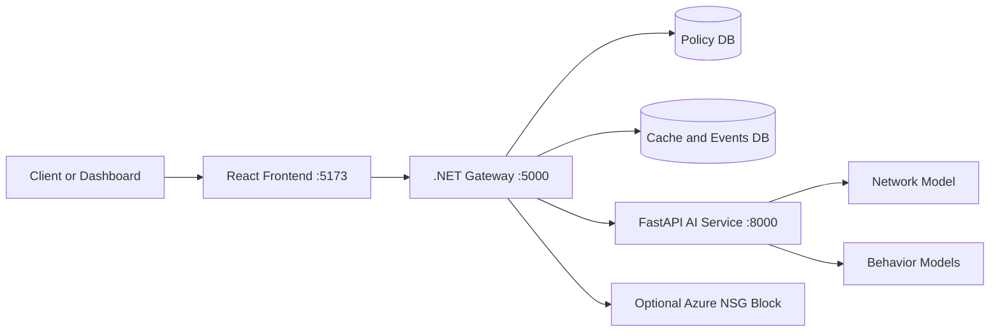
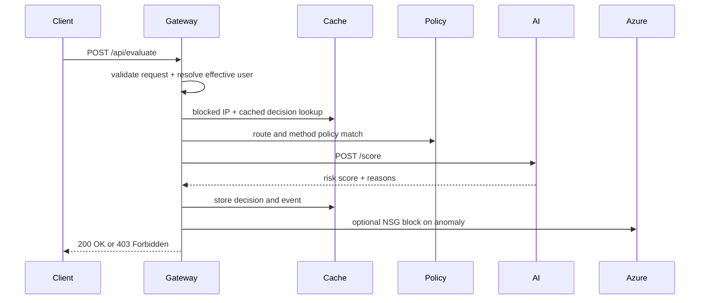

# ZTA: Zero-Trust Access Project

This repository contains a working zero-trust access proof of concept built with:

- React frontend
- .NET gateway
- Python AI scoring service
- SQLite and optional SQL Server storage
- optional Docker, Azure, and Kubernetes integration paths

The project evaluates whether a request should be allowed even after identity is known.

## What The Project Does

For each request, the system checks:

1. policy: is this user allowed on this route and method?
2. network risk: does the request pattern look anomalous?
3. behavior risk: if behavior features are present, do they look like the expected user?
4. context: is the path, method, or timing suspicious?

The request is allowed only when:

1. policy matches
2. combined risk stays below the threshold

## Architecture



## Request Flow



## Tech Stack

### Frontend

- `React`
- `Vite`
- `JavaScript`
- CSS
- browser `fetch`

### Backend Gateway

- `C#`
- `.NET 10`
- ASP.NET Core Minimal APIs
- `Entity Framework Core`
- `HttpClient`
- `System.IdentityModel.Tokens.Jwt`

### AI Service

- `Python`
- `FastAPI`
- `Pydantic`
- `NumPy`
- `Pandas`
- `scikit-learn`
- `joblib`
- `Uvicorn`

### Databases

- `SQLite`
- `SQL Server Developer Edition`
- SQL Server container support through Docker

### Cloud and Infra

- `Azure Identity`
- `Azure Resource Manager`
- Azure NSG rule automation support
- `Docker`
- `Docker Compose`
- starter `Kubernetes` manifests
- `Bicep`

### Testing and Operations

- PowerShell smoke tests
- xUnit gateway test scaffold

## Repository Structure

```text
ZTA/
  src/
    web/                    # React dashboard
    gateway/Zta.Gateway/    # .NET gateway
    ai-service/             # Python AI scoring service
  database/migrations/      # SQL scripts for DB setup
  infra/azure/              # Bicep starter templates
  k8s/                      # starter Kubernetes manifests
  tests/                    # smoke tests and gateway test scaffold
  README.md
  THEORY.md
```

## Local URLs

### Frontend

- App: `http://localhost:5173`

### Gateway

- Base: `http://localhost:5000`
- Health: `http://localhost:5000/health`
- Policies: `http://localhost:5000/api/policies`
- Events: `http://localhost:5000/api/events`
- Evaluate: `http://localhost:5000/api/evaluate`
- Kill switch: `http://localhost:5000/api/kill-switch`

### AI Service

- Base: `http://localhost:8000`
- Health: `http://localhost:8000/health`
- Config: `http://localhost:8000/config`
- Score: `http://localhost:8000/score`
- Debug behavior score: `http://localhost:8000/debug/behavior-score`
- Reload models: `http://localhost:8000/reload-models`

### Optional SQL Server in Docker

- SQL Server: `localhost:1433`

## API Endpoints

### Gateway Endpoints

#### `GET /`

Simple service status.

#### `GET /health`

Returns:

- service status
- UTC time
- policy store provider
- AI service base URL
- Azure block enabled flag

#### `GET /api/policies`

Returns configured access policies.

#### `GET /api/events`

Returns recent decision events ordered by Unix timestamp.

#### `POST /api/evaluate`

Purpose:

- validate incoming request data
- resolve effective user identity
- check policy
- call AI scoring service
- produce allow or block decision

Example request:

```json
{
  "userId": "prayas",
  "sourceIp": "203.0.113.10",
  "path": "/api/data",
  "method": "GET",
  "requestsPerMinute": 5,
  "payloadBytes": 2048,
  "hourOfDay": 14,
  "requestLatencyMs": 120,
  "behaviorSubject": "s002",
  "behaviorFeatures": {
    "H.period": 0.12,
    "DD.period.t": 0.33
  }
}
```

Expected response fields:

- `allowed`
- `reason`
- `reasonDetails`
- `riskScore`
- `isAnomaly`
- `source`

#### `POST /api/kill-switch`

Purpose:

- manually block a source IP
- create blocked entry
- write a security event
- optionally trigger Azure NSG action

Example request:

```json
{
  "userId": "operator",
  "sourceIp": "203.0.113.10",
  "reason": "manual-test"
}
```

### AI Service Endpoints

#### `GET /health`

Returns:

- model load state
- behavior model count
- degraded mode state
- configured weights and threshold

#### `GET /config`

Returns current runtime scoring knobs:

- `NETWORK_WEIGHT`
- `BEHAVIOR_WEIGHT`
- `ANOMALY_THRESHOLD`
- `ALLOW_DEGRADED_SCORING`

#### `POST /score`

Main scoring endpoint used by the gateway.

Returns:

- `anomaly_score`
- `is_anomaly`
- `reasons`
- `degraded_mode`
- `model_status`

#### `POST /debug/behavior-score`

Behavior-only debug endpoint for testing subject models.

#### `POST /reload-models`

Reloads network and behavior model artifacts from disk.

## How To Run Locally

## Step 1: Install dependencies

From repo root:

```powershell
cd e:\SAVED_CODES_AND_PROJECT\code-playing\ZTA
.\install-all.ps1
```

This installs:

- Python packages into local `.venv`
- frontend packages into local `node_modules`
- .NET packages with local cache paths

## Step 2: Start the AI service

```powershell
cd e:\SAVED_CODES_AND_PROJECT\code-playing\ZTA\src\ai-service
& "e:\SAVED_CODES_AND_PROJECT\code-playing\ZTA\.venv\Scripts\python.exe" -m uvicorn app.main:app --host 0.0.0.0 --port 8000 --reload
```

Expected:

- terminal shows startup complete
- `http://localhost:8000/health` works
- model counts appear in response

## Step 3: Start the gateway

```powershell
cd e:\SAVED_CODES_AND_PROJECT\code-playing\ZTA\src\gateway\Zta.Gateway
dotnet run
```

Expected:

- gateway starts on `http://localhost:5000`
- database bootstrap runs
- demo policies are seeded if missing

## Step 4: Start the frontend

```powershell
cd e:\SAVED_CODES_AND_PROJECT\code-playing\ZTA\src\web
npm run dev
```

Expected:

- Vite starts
- open `http://localhost:5173`

## Step 5: Verify the system

```powershell
curl http://localhost:8000/health
curl http://localhost:5000/health
curl http://localhost:5000/api/policies
curl http://localhost:5000/api/events
```

## What To Expect

### Healthy AI service

Example:

```json
{
  "status": "ok",
  "network_model_loaded": true,
  "behavior_models_loaded": 51,
  "user_subject_map_loaded": true,
  "degraded_mode": false
}
```

### Healthy gateway

Example:

```json
{
  "status": "ok",
  "utc": "2026-04-21T00:00:00+00:00",
  "policyStore": "Sqlite",
  "aiServiceBaseUrl": "http://localhost:8000",
  "azureBlockEnabled": false
}
```

### Normal request

Expected:

- `200 OK`
- `reason = allowed-by-policy`

### Suspicious request

Expected:

- `403 Forbidden`
- `reason = anomaly-detected`
- detailed AI reasons in `reasonDetails`

### Manual kill-switch

Expected:

- blocked status response
- follow-up traffic from that IP gets denied
- event visible in `/api/events`

## Smoke Tests

### AI smoke test

```powershell
cd e:\SAVED_CODES_AND_PROJECT\code-playing\ZTA\src\ai-service
python .\smoke_test.py
```

### Gateway smoke test

```powershell
cd e:\SAVED_CODES_AND_PROJECT\code-playing\ZTA
.\tests\gateway-smoke.ps1
```

The gateway smoke test checks:

- health path
- allow path
- anomaly block path
- manual kill-switch
- event creation

## Using SQL Server With The Project

You can use local SQL Server Developer Edition instead of SQLite for the policy store.

### 1. Create the database

In SSMS, run:

```sql
CREATE DATABASE ZtaPolicy;
GO
```

### 2. Configure the gateway

Update [appsettings.json](e:/SAVED_CODES_AND_PROJECT/code-playing/ZTA/src/gateway/Zta.Gateway/appsettings.json):

```json
"PolicyStore": {
  "Provider": "SqlServer"
},
"ConnectionStrings": {
  "PolicyDbSqlServer": "Server=localhost;Database=ZtaPolicy;Trusted_Connection=True;TrustServerCertificate=True;Encrypt=False",
  "DecisionCacheDb": "Data Source=zta-cache.db"
}
```

### 3. Start gateway again

```powershell
cd e:\SAVED_CODES_AND_PROJECT\code-playing\ZTA\src\gateway\Zta.Gateway
dotnet run
```

The cache/events DB can still remain on SQLite.

## Using Docker With The Project

Docker is useful when you want:

- SQL Server containerized
- repeatable startup
- easier multi-service orchestration

### 1. Install Docker Desktop

After installation:

```powershell
docker --version
docker compose version
docker info
```

### 2. Create `.env`

From repo root:

```powershell
copy .env.example .env
```

Set a strong `SA_PASSWORD` in `.env`.

### 3. Start the stack

```powershell
docker compose up --build
```

### 4. Verify

```powershell
docker compose ps
docker compose logs -f gateway
docker compose logs -f ai-service
docker compose logs -f mssql
```

### 5. URLs

- gateway: `http://localhost:5000/health`
- ai service: `http://localhost:8000/health`

### Docker sign-in note

For this local setup, Docker sign-in is usually not required because the images used are public.

You only need Docker login if:

- you push to a private registry
- you pull protected images

## Using Azure Integration

Azure is optional for local development.

It becomes relevant when you want:

- NSG rule creation for auto-block
- Azure-based deployment or infra provisioning

### For Azure NSG blocking

In `appsettings.json`, configure:

- `AzureBlock.Enabled`
- `AzureBlock.SubscriptionId`
- `AzureBlock.ResourceGroup`
- `AzureBlock.NetworkSecurityGroupName`

Then authenticate locally:

```powershell
az login
```

The gateway uses:

1. `AzureCliCredential`
2. then `DefaultAzureCredential`

So `az login` is the practical local setup path.

## Using Kubernetes

Kubernetes is not required for local use.

It is a starter deployment path only.

Starter manifests are in `k8s/`.

Basic flow:

```powershell
kubectl apply -f .\k8s\namespace.yaml
kubectl apply -f .\k8s\configmap.yaml
kubectl apply -f .\k8s\secret.example.yaml
kubectl apply -f .\k8s\mssql.yaml
kubectl apply -f .\k8s\ai-service.yaml
kubectl apply -f .\k8s\gateway.yaml
```

Before that, you need:

- Docker Desktop Kubernetes enabled or another cluster
- built/published images for gateway and AI service

## Current Status

What is working now:

- local frontend, gateway, and AI service
- real network and behavior model loading
- structured request validation
- policy check + anomaly scoring + event logging
- manual kill-switch
- SQLite local mode
- SQL Server configurable policy mode
- Docker compose setup
- Azure NSG block path implemented behind config

What is still not fully production-hardened:

- full JWT validation middleware
- formally executed xUnit suite in this environment
- exact feature parity between runtime network features and training feature space
- complete production-grade Kubernetes and Azure rollout configuration

## Final Project Files To Read

Only two top-level docs should matter now:

- [README.md](e:/SAVED_CODES_AND_PROJECT/code-playing/ZTA/README.md): project and runbook
- [THEORY.md](e:/SAVED_CODES_AND_PROJECT/code-playing/ZTA/THEORY.md): domain and conceptual understanding
