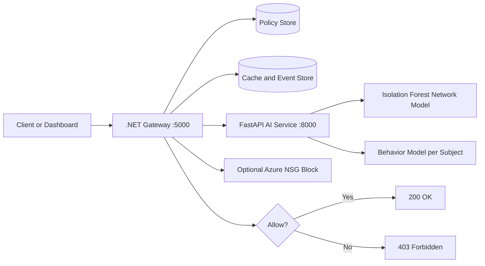
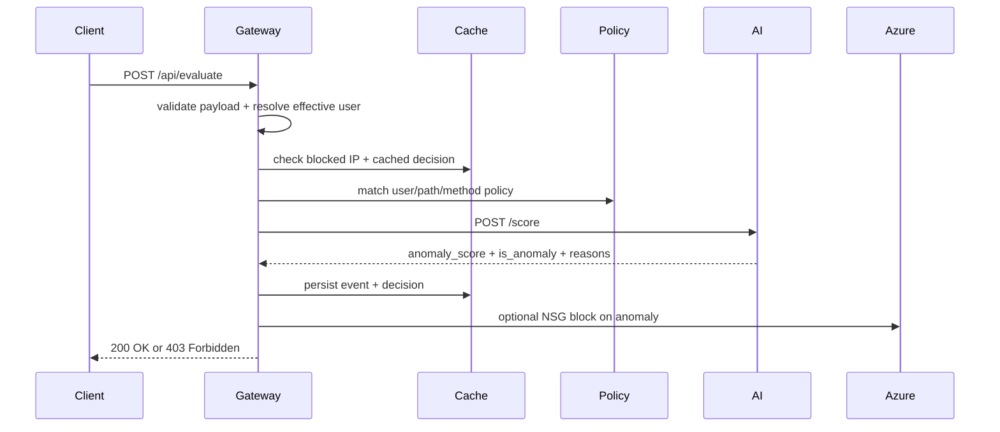

# ZTA: Zero-Trust Access PoC

This repository is a working zero-trust proof of concept built around one rule:

> a request is not trusted just because the caller is authenticated.

Each request is evaluated through:
- policy: is the caller allowed to access this route and method?
- network risk: does the traffic pattern look anomalous?
- behavior risk: if keystroke-style features are present, does it look like the expected user?

The current codebase is a local-first PoC with optional Docker, SQL Server, and Azure-oriented paths.

## What This Project Does

Think of the gateway as a security checkpoint:
- policy is the access badge
- the network model is the metal detector
- the behavior model is the guard checking whether the person acts like the expected identity

The request is allowed only when:
1. the access policy matches
2. the final risk score stays below the anomaly threshold

If the request is blocked:
- the event is stored
- the decision is cached
- the source IP can be added to a blocked list
- Azure NSG blocking can be triggered when enabled and configured

## Current Runtime View



## Request Flow



## Technologies Used

### Frontend
- `React`
- `Vite`
- `JavaScript`
- browser `fetch` API
- CSS

### Backend
- `C#`
- `.NET 10` minimal APIs
- `Entity Framework Core`
- `HttpClient`
- `System.IdentityModel.Tokens.Jwt`

### AI Service
- `Python`
- `FastAPI`
- `Pydantic`
- `NumPy`
- `Pandas`
- `scikit-learn`
- `joblib`
- `Uvicorn`

### Databases and Storage
- `SQLite` for local cache and event storage
- `SQLite` or `SQL Server` for policy store, depending on config
- `SQL Server Developer Edition` supported for local policy DB

### Cloud and Infra
- `Azure Identity`
- `Azure Resource Manager`
- `Azure Network Security Group` rule updates when enabled
- `Docker`
- `Docker Compose`
- starter `Kubernetes` manifests
- `Bicep` starter templates under `infra/azure`

### Testing and Ops
- PowerShell smoke tests
- xUnit test project scaffold for gateway integration tests

## Repo Layout

```text
ZTA/
  src/
    gateway/Zta.Gateway/   # C# gateway, policy evaluation, caching, kill-switch
    ai-service/            # Python scoring service + trained model artifacts
    web/                   # React dashboard
  database/migrations/     # SQL migration scripts checked in
  k8s/                     # starter Kubernetes manifests
  infra/azure/             # starter Azure Bicep templates
  tests/                   # smoke tests + gateway test project
  LOCAL_API_AND_RUNBOOK.md
  DEPLOYMENT.md
  THEORY.md
  ARCH.md
  PREREQUISITES.md
```

## Current Local Modes

### Mode 1: Local-first recommended

Use this for day-to-day development:
- AI service on `localhost:8000`
- gateway on `localhost:5000`
- frontend on `localhost:5173`
- SQLite policy/cache by default

### Mode 2: SQL Server local mode

Use this when you want the policy store on your local SQL Server Developer Edition:
- set `PolicyStore.Provider` to `SqlServer`
- point `ConnectionStrings:PolicyDbSqlServer` to your local instance

### Mode 3: Docker Compose

Use this when you want:
- repeatable startup
- SQL Server container
- a near-deployment style environment

## How To Run

### 1. Install local dependencies

```powershell
.\install-all.ps1
```

### 2. Start AI service

```powershell
cd e:\SAVED_CODES_AND_PROJECT\code-playing\ZTA\src\ai-service
& "e:\SAVED_CODES_AND_PROJECT\code-playing\ZTA\.venv\Scripts\python.exe" -m uvicorn app.main:app --host 0.0.0.0 --port 8000 --reload
```

Expected:
- terminal shows `Application startup complete`
- `http://localhost:8000/health` returns model status, degraded mode, and weights

### 3. Start gateway

```powershell
cd e:\SAVED_CODES_AND_PROJECT\code-playing\ZTA\src\gateway\Zta.Gateway
dotnet run
```

Expected:
- gateway starts on `http://localhost:5000`
- startup bootstraps databases and seeds default policies if needed
- `http://localhost:5000/health` returns provider info and Azure block status

### 4. Start frontend

```powershell
cd e:\SAVED_CODES_AND_PROJECT\code-playing\ZTA\src\web
npm run dev
```

Expected:
- Vite serves on `http://localhost:5173`
- dashboard loads the policy/event data through the gateway

## What To Expect When Running

### Healthy AI service

`GET http://localhost:8000/health`

Expected shape:

```json
{
  "status": "ok",
  "network_model_loaded": true,
  "behavior_models_loaded": 51,
  "user_subject_map_loaded": true,
  "degraded_mode": false
}
```

### Healthy gateway

`GET http://localhost:5000/health`

Expected shape:

```json
{
  "status": "ok",
  "utc": "2026-04-21T00:00:00+00:00",
  "policyStore": "Sqlite",
  "aiServiceBaseUrl": "http://localhost:8000",
  "azureBlockEnabled": false
}
```

### Policy list

`GET http://localhost:5000/api/policies`

Expected:
- seeded demo policies for `prayas`

### Evaluate a normal request

`POST http://localhost:5000/api/evaluate`

Expected:
- `200 OK`
- `allowed: true`
- `reason: allowed-by-policy`
- structured `reasonDetails`

### Evaluate an attack-like request

Expected:
- `403 Forbidden`
- `reason: anomaly-detected`
- AI reasons such as frequency spike or payload burst
- event stored in `/api/events`

### Manual kill-switch

`POST http://localhost:5000/api/kill-switch`

Expected:
- IP added to blocked list
- follow-up requests from that IP get blocked
- event visible in `/api/events`

## Smoke Tests

### AI smoke test

```powershell
cd e:\SAVED_CODES_AND_PROJECT\code-playing\ZTA\src\ai-service
python .\smoke_test.py
```

### Gateway smoke test

```powershell
cd e:\SAVED_CODES_AND_PROJECT\code-playing\ZTA
.\tests\gateway-smoke.ps1
```

What the gateway smoke test checks:
- gateway health
- allow path
- anomaly block path
- manual kill-switch
- event emission

## Key Endpoints

### Gateway
- `GET /`
- `GET /health`
- `GET /api/policies`
- `GET /api/events`
- `POST /api/evaluate`
- `POST /api/kill-switch`

### AI service
- `GET /health`
- `GET /config`
- `POST /score`
- `POST /debug/behavior-score`
- `POST /reload-models`

See full local URLs and commands in [LOCAL_API_AND_RUNBOOK.md](e:/SAVED_CODES_AND_PROJECT/code-playing/ZTA/LOCAL_API_AND_RUNBOOK.md).

## Current Strengths

- working local end-to-end PoC
- real trained network and behavior models are loaded
- gateway now validates input and resolves effective user identity
- structured decision reason details are returned and cached
- event ordering now uses sortable Unix timestamps
- Azure NSG block path is implemented behind config
- smoke-test tooling exists for gateway and AI service

## Current Constraints

- formal `dotnet test` execution was not runnable in the sandbox because NuGet access was blocked
- EF migration classes were not generated in this environment because `dotnet-ef` was unavailable, so SQL migration scripts were checked in instead
- runtime network feature mapping is still an approximation of the training feature space
- JWT parsing is present, but full token validation middleware is not yet wired

## Related Docs

- [LOCAL_API_AND_RUNBOOK.md](e:/SAVED_CODES_AND_PROJECT/code-playing/ZTA/LOCAL_API_AND_RUNBOOK.md)
- [DEPLOYMENT.md](e:/SAVED_CODES_AND_PROJECT/code-playing/ZTA/DEPLOYMENT.md)
- [PREREQUISITES.md](e:/SAVED_CODES_AND_PROJECT/code-playing/ZTA/PREREQUISITES.md)
- [THEORY.md](e:/SAVED_CODES_AND_PROJECT/code-playing/ZTA/THEORY.md)
- [ARCH.md](e:/SAVED_CODES_AND_PROJECT/code-playing/ZTA/ARCH.md)
- [MODEL_CALIBRATION.md](e:/SAVED_CODES_AND_PROJECT/code-playing/ZTA/src/ai-service/MODEL_CALIBRATION.md)
