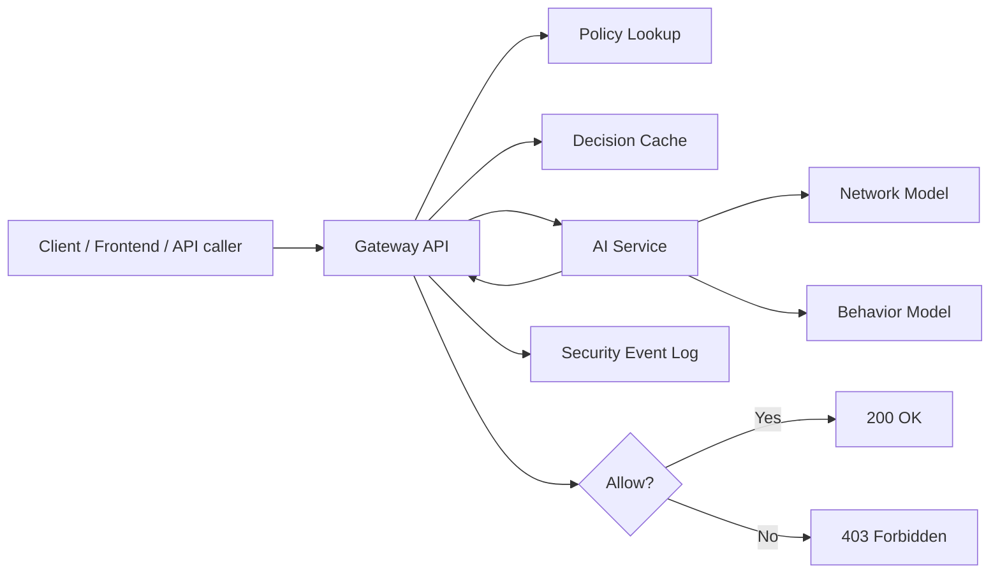
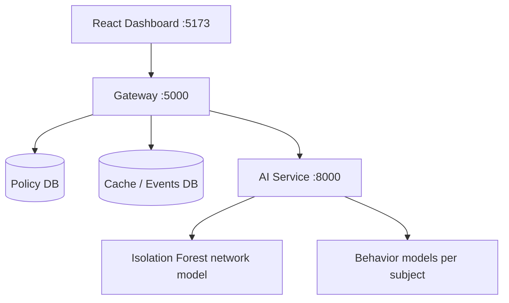
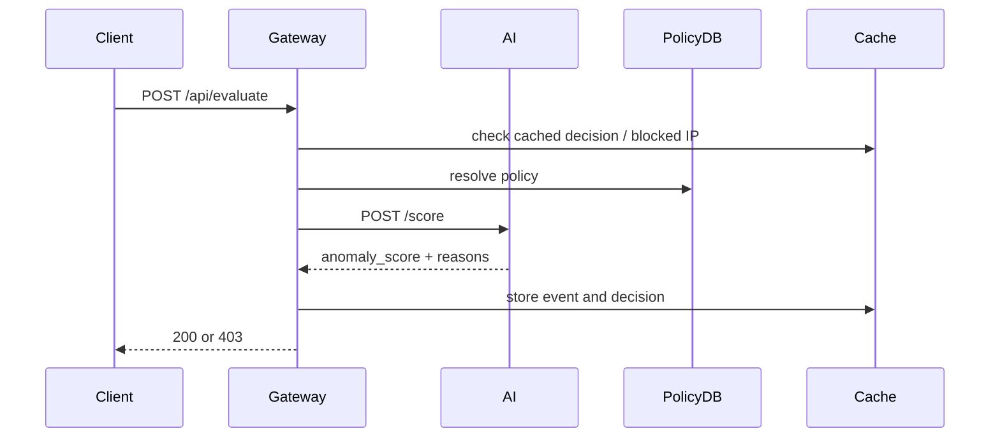

# ZTA: Zero-Trust Access PoC

This repository is a working Zero-Trust proof of concept built around one simple idea:

> a request is not trusted just because the user is authenticated.

Every request is checked in three layers:
- policy: is this user allowed to call this route?
- anomaly: does the request look suspicious at the traffic level?
- behavior: if behavior data is present, does it look like the expected user?

The current system runs locally with:
- `React` dashboard
- `.NET` gateway
- `FastAPI` AI scoring service
- `SQLite` local policy/cache store
- optional `SQL Server` / Azure-oriented path for later deployment

## Intuition

Think of the gateway as a smart security checkpoint:
- policy is the access badge
- network model is the metal detector
- behavior model is the guard recognizing whether the person is walking and acting normally

The request is only allowed if:
1. policy allows it
2. the combined risk score stays below the anomaly threshold

## What Happens On Each Request



## Repo Layout

```text
ZTA/
  src/
    gateway/Zta.Gateway/   # C# gateway, policy evaluation, cache, events
    ai-service/            # Python AI scoring service + trained model artifacts
    web/                   # React dashboard
  infra/azure/             # starter Bicep templates
  LOCAL_API_AND_RUNBOOK.md # local URLs + commands
  THEORY.md                # problem framing / research-style explanation
  ARCH.md                  # current implemented architecture
```

## Current Architecture



## Components

### 1. Gateway

The gateway is the main control plane.

It does:
- route/method policy matching
- blocked-IP checks
- short-lived decision caching
- event logging
- manual kill-switch handling
- forwarding request telemetry to the AI service

Current local mode:
- policy store: SQLite
- cache/events: SQLite

### 2. AI Service

The AI service loads real trained artifacts from `src/ai-service/models/`:
- network: `network_iforest.joblib`
- behavior: `behavior_*.joblib`

It computes:
- network anomaly score
- route/method/off-hours contextual risk
- optional behavioral anomaly score

Then it returns:
- `anomaly_score`
- `is_anomaly`
- explanation reasons

### 3. Frontend

The dashboard is an operator view, not an end-user app.

It currently provides:
- live risk meter
- traffic stream
- manual kill-switch button

## Local Run Modes

### Recommended now: local-first mode

This is the easiest current path and does not require Docker.

1. Start AI service
2. Start gateway
3. Start frontend

### Optional later: Docker mode

Docker is useful when you want:
- repeatable setup
- SQL Server container
- single-command startup
- an easier path toward Kubernetes

Kubernetes is not required for local use. It is only a future deployment/orchestration step.

## Quick Start

### Install dependencies locally

```powershell
.\install-all.ps1
```

### Start AI service

```powershell
cd src\ai-service
& "..\..\..\.venv\Scripts\python.exe" -m uvicorn app.main:app --host 0.0.0.0 --port 8000 --reload
```

Health:
- `http://localhost:8000/health`

### Start gateway

```powershell
cd src\gateway\Zta.Gateway
dotnet run
```

Health:
- `http://localhost:5000/health`

### Start frontend

```powershell
cd src\web
npm run dev
```

Dashboard:
- `http://localhost:5173`

## Key Endpoints

### Gateway
- `GET /health`
- `GET /api/policies`
- `GET /api/events`
- `POST /api/evaluate`
- `POST /api/kill-switch`

### AI service
- `GET /health`
- `POST /score`

See full URL list and commands in [LOCAL_API_AND_RUNBOOK.md](e:/SAVED_CODES_AND_PROJECT/code-playing/ZTA/LOCAL_API_AND_RUNBOOK.md).

## Example Request Flow



## Current Strengths

- working end-to-end local PoC
- real model artifacts are integrated, not placeholders
- behavior path is wired through gateway to AI
- manual kill-switch works
- documentation now includes theory, architecture, and runbook files

## Current Limitations

- Azure NSG blocker is still a stub
- network feature mapping is approximate relative to the training dataset
- `/api/events` sorts in-memory because of SQLite `DateTimeOffset` limitations
- behavior scoring depends on `behaviorFeatures` being available in the request

## Suggested Improvements

Highest-value next steps:
- implement a real Azure NSG update path in the blocker service
- add integration tests for normal vs attack vs behavior-mismatch flows
- improve the runtime network feature mapping so it better matches training features
- add structured logs / metrics for decision auditability
- expose service health more explicitly in the UI

## Related Docs

- [LOCAL_API_AND_RUNBOOK.md](e:/SAVED_CODES_AND_PROJECT/code-playing/ZTA/LOCAL_API_AND_RUNBOOK.md)
- [THEORY.md](e:/SAVED_CODES_AND_PROJECT/code-playing/ZTA/THEORY.md)
- [ARCH.md](e:/SAVED_CODES_AND_PROJECT/code-playing/ZTA/ARCH.md)
