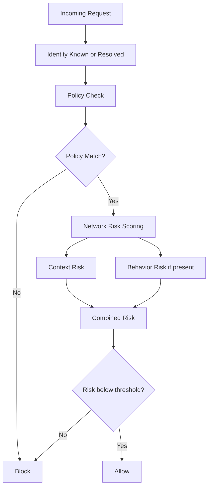
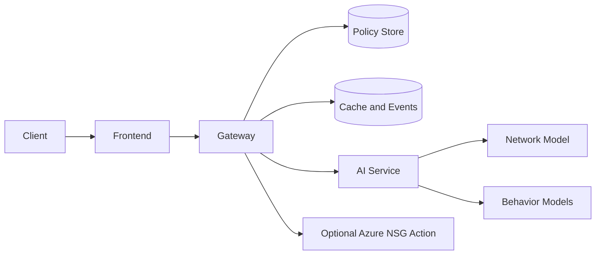

# Theory And Domain Context

## What Domain This Project Targets

This project targets the intersection of:

- cybersecurity
- zero-trust access control
- anomaly detection
- behavioral biometrics
- cloud/network enforcement

The core problem is not ordinary login or CRUD application development. The problem is:

> after a user is authenticated, can the system still decide whether the request should be trusted right now?

That is the domain this project lives in.

## Why This Domain Matters

Traditional security models often assume:

1. if a user has logged in, they are trusted
2. if a request comes from inside the network, it is relatively safe
3. if the role looks valid, the action can proceed

These assumptions break in common attack scenarios:

- stolen credentials
- token/session hijacking
- insider misuse
- low-and-slow data exfiltration
- API abuse by valid but compromised accounts

This is why zero trust exists.

Zero trust changes the security question from:

> "Was the user authenticated once?"

to:

> "Should this specific request be trusted now, in this context, with this behavior, for this route?"

## The Specific Problem We Are Solving

The project aims to build a request-time access decision engine that combines:

1. policy logic
2. network anomaly detection
3. optional behavioral identity evidence
4. operational response such as blocking and event visibility

In practical terms, the system should help detect:

- valid user accessing an invalid endpoint
- unusual request bursts from a legitimate account
- suspicious off-hours access
- keystroke/interaction behavior inconsistent with the expected user
- attack-like API traffic that policy alone cannot catch

## Intuition

Think of a secure building.

- authentication is the ID card
- authorization policy is the rulebook at the gate
- anomaly detection is the metal detector
- behavior biometrics is the guard recognizing whether the person acts like the expected person

A valid ID is not enough if:

- the person is trying to enter the wrong room
- they are carrying suspicious equipment
- their behavior does not match the expected person

That is exactly what this project models for API traffic.

## Core Security Principle

The project is built on a zero-trust principle:

> never trust implicitly; verify continuously and contextually

This means a request is evaluated using multiple signals, not just one binary auth check.

## High-Level Decision Logic

## Why Policy Alone Is Not Enough

Policy answers:

- who can access what
- which route/method combinations are allowed

Policy does not answer:

- whether the traffic pattern is suspicious
- whether the user behavior is abnormal
- whether the access timing is unusual
- whether a valid identity is being abused

So policy is necessary but insufficient.

## Why AI/ML Is Introduced

The AI component exists to answer a different class of questions:

- does the traffic look like normal behavior?
- does the request rate or size look unusual?
- do the behavior signals look like the enrolled subject?

This is an anomaly detection problem, not a rule-only problem.

## Network Anomaly Modeling

The network side of this project is based on intrusion-detection style flow data.

Model family used:

- Isolation Forest

Reason:

- practical for anomaly detection
- good baseline for outlier-style problems
- does not require fully supervised labels for every runtime case

Conceptually:

1. learn what normal request/traffic patterns look like
2. assign higher risk to unusual patterns

Examples of suspicious signals:

- sudden spike in requests per minute
- unusually large payload size
- abnormal latency characteristics
- unusual access context such as admin or off-hours requests

## Behavioral Biometrics

Authentication can be stolen. Behavior is harder to imitate consistently.

Behavioral biometrics in this project use timing-style features such as:

- key hold times
- transition delays between keys
- typing rhythm

The idea is:

- the same credentials can be used by two different people
- their fine-grained behavioral patterns often differ

This makes behavioral modeling useful as a secondary trust signal.

## Why This Combination Is Stronger

The project combines:

1. deterministic control
2. statistical control
3. operational visibility

More precisely:

- policy gives explicit authorization boundaries
- anomaly detection catches unusual patterns within allowed boundaries
- behavior scoring helps detect identity misuse
- event logging and kill-switch support operator response

This hybrid approach is more realistic than using any single layer alone.

## Importance Of This Domain In Industry

This domain matters in:

- enterprise API security
- SaaS platform protection
- privileged access control
- SOC and incident response workflows
- insider threat detection
- identity-centric cloud security

Modern organizations increasingly expose:

- APIs
- cloud workloads
- internal developer portals
- remote admin surfaces

That makes request-time trust evaluation a practical need, not a theoretical one.

## CS Fundamentals Needed To Understand This Project

### 1. Client-server systems

You should understand:

- HTTP requests and responses
- service-to-service communication
- ports and local URLs

### 2. Authentication vs authorization

- authentication = who are you
- authorization = what are you allowed to do

This project mainly extends authorization with dynamic risk scoring.

### 3. API design

You should be comfortable with:

- `GET`, `POST`
- JSON payloads
- HTTP status codes like `200`, `400`, `403`

### 4. Databases

You need basic understanding of:

- tables/entities
- primary keys
- indexes
- querying
- cache vs durable store

### 5. Caching

This project caches recent decisions to avoid unnecessary recomputation and repeated model calls.

Important ideas:

- cache hit
- cache miss
- TTL
- consistency tradeoff

### 6. Basic ML concepts

You do not need deep ML math, but you do need:

- feature vectors
- scores
- thresholds
- false positives
- false negatives
- anomaly detection intuition

### 7. Distributed systems basics

Even locally, this is already a distributed system:

- frontend
- gateway
- AI service
- database layers

So you should understand:

- service boundaries
- timeouts
- health checks
- partial failure

### 8. Cloud/network security basics

To understand the Azure/network side, you need:

- IP addresses
- NSG concepts
- why network-level deny rules matter
- why automation is useful after a threat decision

## Why The Project Uses Multiple Components

Each part exists for a reason:

- frontend: operator visibility and manual controls
- gateway: decision orchestration and enforcement point
- AI service: model execution and scoring isolation
- DB layer: policies, cache, events, blocked IPs
- Azure path: network-level response capability

This separation improves:

- clarity
- maintainability
- operational control
- future deployability

## What Makes This More Than A Demo Dashboard

This project is not mainly about the UI.

It is a security decision system with:

- policy evaluation
- model-backed scoring
- service orchestration
- storage and eventing
- operator response hooks

The dashboard exists because security systems require observability and operator action.

## Typical Use Cases

1. API gateway with dynamic trust scoring
2. protected admin surface with anomaly-aware access control
3. research/demo platform for zero trust plus ML fusion
4. security engineering prototype for cloud-native access control

## Main Tradeoffs In This Domain

Every security decision system must balance:

### 1. False positives

Too aggressive:

- more attacks caught
- more legitimate traffic blocked

### 2. False negatives

Too lenient:

- fewer disruptions
- more malicious activity passes

### 3. Latency vs depth

More checks can improve trust quality but increase response latency.

### 4. Simplicity vs realism

Simple policy systems are easy to reason about but weak against misuse.
Richer anomaly systems are stronger but harder to calibrate.

## Why This Project Is Worth Building

This project demonstrates a practical bridge between:

- software engineering
- security architecture
- ML-based anomaly detection
- operator response workflow

That makes it a strong project for:

- cybersecurity portfolios
- systems design discussion
- applied ML in security contexts
- cloud and backend engineering showcases

## Final Summary

This project targets the zero-trust security domain, specifically request-time trust evaluation for APIs and service access.

It matters because valid credentials are no longer enough to treat traffic as safe.

The system therefore combines:

- explicit policy rules
- anomaly-aware risk scoring
- optional behavior-based identity signals
- event visibility
- automated or manual blocking paths

That combination is the real subject of the project.
